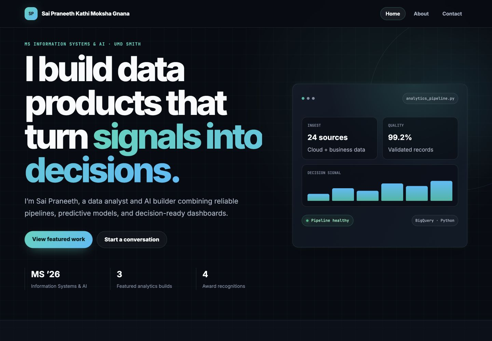
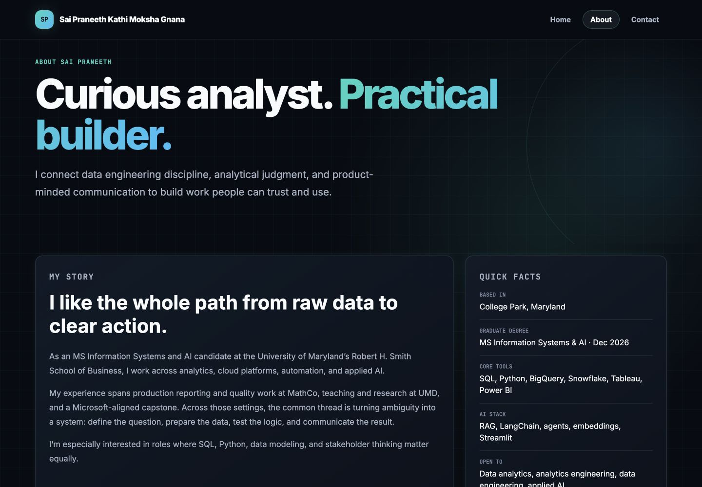
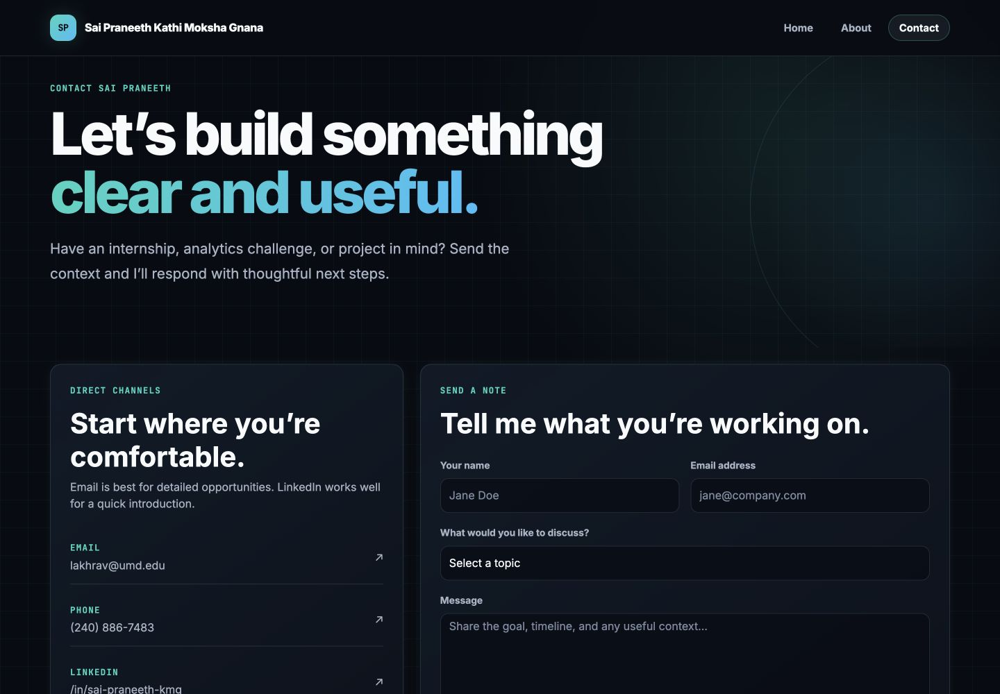

# BUDT748 Client-Side Technology — Submission

## Required links

- Live website: https://photon7777.github.io/budt748-client-side-portfolio/
- GitHub repository: https://github.com/Photon7777/budt748-client-side-portfolio
- Figma design: https://www.figma.com/design/Pjb8gwbGaZ4U3TdcXIVA6c

## Screenshots

### Home

### About

### Contact

## Implementation notes

- Three separate pages: `index.html`, `about.html`, and `contact.html`
- Shared custom stylesheet: `css/styles.css`
- Bootstrap 5.3 grid, navigation, buttons, cards, utilities, and form controls
- Responsive desktop and mobile behavior
- Full name displayed in the header on every page
- Contact form validation and email-draft behavior implemented with `js/main.js`
